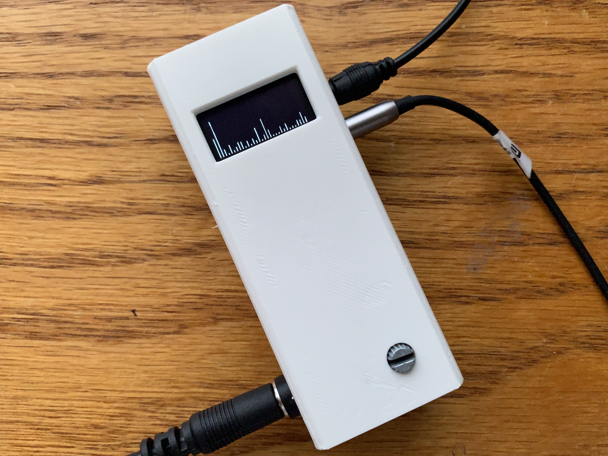

# attiny85-spectrum

The goal of this project is to get smooth, appealing music visualization on the ATTiny85, optimizing around its limited speed and resources (RAM and program memory). Its on ongoing personal project right now which I mean to add to later (outside help is welcome!), but it's otherwise fully functional and ready to be flashed. Some special steps are required, however, and will be listed below.

## Explanation
The linchpins to enabling music visualization with an ATTiny85 are two libraries: 

- kosme's AVR implementation of [fix_fft](https://github.com/kosme/fix_fft), a faster 8-bit integer-based FFT
- lexus2k's [ssd1306](https://github.com/lexus2k/ssd1306) library and its nanoengine API, which outputs to the OLED in 32x32 chunks because the ATTiny85 can't hold the entire screen in memory

I had to change the pin assignments in the ssd1306 library to free up an analog-capable pin, and in the fix_fft library I changed the char type buffers into int8_t ones. Both modified libraries are availible, and they must be placed in the Arduino libraries folder, overwriting the original ones (keep a backup!). *Recently kosme has updated the fix_fft library to int8_t defintions as well, so you can probably just use his latest commit.* Additionally, I raised the OSCCAL value to 240, giving me an internal clock of about 30MHz. It's usually used for clock calibration, but it has been used successfully for overclocking. However, it's only found on the ATTiny85 and a few other Atmel MCUs.

The core of the program is a loop of this:

1. The music is sampled with the ADC at pin 3/A3, which is then mapped to the range that int8_t covers (0 to 1023 -> -128 to 127)
     * A prescaler of 16 gives a sampling frequency of about 2MHz (considering the overclock), so empty while loops are used to maintain the user-set sampling frequency
2. The average value is subtracted from all samples. This lets the first band represent extremely low frequencies, rather than being swamped with the DC bias
3. The "fix_fftr" function, which runs twice as fast as and uses half the memory of the "fix_fft" version because it doesn't need imaginary data
4. The output is cut off below 0, scaled up, and time-smoothed using the previous output and fixed factors
5. The modified output is fed into the OLED part-by-part using the nanoengine API

## Components

- ATTiny85
- SSD1306 OLED Module
- 3-Pole Audio Jack (1, 2 for pass-through)
- 2N3904 or other NPN transistor
- 0.1uF Capacitor
- Potentiometer, any value above 10k
- 200 Ohm Resistor (2)
- 820 Ohm Resistor
- 100k Ohm Resistor
- External 5V Power Supply

## Schematic

## Demonstration

### Enclosure

The STL of the enclosure in the video is included in this repo. Printed on a Monoprice Select Mini V2. See [this](images/Inside.jpg) picture for component placements on a 3x7 protoboard.

## Limitations/TO-DO

- The fix_fft library uses linear scaling for both frequency and power... and without much resolution in either / *No room for logarithmic scaling? TO-DO: Attempt to implement later.*
- The OLED display regularly shows detached bars that only really appear in still photos / *TO-DO: Find out why*

